This section contains a flowchart of how `libvdo` types are connected to each other.
The purpose is to make it easier to understand how the library works,
in particular when contributing to the safe abstraction that sits on top of it.

The flowchart includes all functions that either:
- return a custom type
- takes arguments of two or more distinct, custom types

Additionally these changes have been made to make the chart easier to read:
- The `Map` type is separated into an input type and an output type.
- `Vdo` and `vdo_` prefixes are removed from type and function names respectively.

```mermaid
flowchart LR
%% vdo-buffer.h
%% ...
    buffer_new --> Buffer
%% ...
    Map --> buffer_new_full
    buffer_new_full --> Buffer
%% ...
%%    Buffer --> buffer_get_id
%% ...
%%    Buffer --> buffer_get_fd
%% ...
%%    Buffer --> buffer_get_offset
%% ...
%%    Buffer --> buffer_get_capacity
%% ...
%%    Buffer --> buffer_is_complete
%% ...
%%    Buffer --> buffer_get_opaque
%% ...
%%    Buffer --> buffer_get_data
%% ...
    Buffer --> buffer_get_frame
    buffer_get_frame --> Frame
%% ...
%% vdo-channel.h
%% ...
    channel_get --> Channel
%% ...
    Map --> channel_get_ex
    channel_get_ex --> Channel
%% ...
    channel_get_all --> GListStream
%% ...
    channel_get_filtered --> GListStream
    Map --> channel_get_filtered
%% ...
    Channel --> channel_get_info
    channel_get_info --> Map'
%% ...
    Channel --> channel_get_settings
    channel_get_settings --> Map'
%% ...
    Channel --> channel_set_settings
    Map --> channel_set_settings
%% ...
    Channel --> channel_get_stream_profile
    Format --> channel_get_stream_profile
    channel_get_stream_profile --> Map'
%% ...
    Channel --> channel_get_resolutions
    Map --> channel_get_resolutions
    channel_get_resolutions --> ResolutionSet
%% ...
%%    Channel --> channel_get_id
%% ...
%%    Channel --> channel_set_framerate
%% ...
%% vdo-error.h
%% ...
%%    GError --> error_is_expected
%% ...
%% vdo-frame.h
%% ...
    Frame --> frame_get_frame_type
    frame_get_frame_type --> FrameType
%% ...
%%    Frame --> frame_is_key
%% ...
%%    Frame --> frame_shown
%% ...   
%%    Frame --> frame_get_sequence_nbr
%% ...
%%    Frame --> frame_get_timestamp
%% ...
%%    Frame --> frame_get_custom_timestamp
%% ...
%%    Frame --> frame_get_size
%% ...
%%    Frame --> frame_get_header_size
%% ...
%%    Frame --> frame_get_fd
%% ...
    Frame --> frame_get_extra_info
    frame_get_extra_info --> Map'
%% ...
%%    Frame --> frame_get_opaque
%% ...
%%    Frame --> frame_get_is_last_buffer
%% ...
%%    Frame --> frame_set_size
%% ...
    Frame --> frame_set_frame_type
    FrameType --> frame_set_frame_type
%% ...
    Frame --> frame_set_sequence_nbr
%% ...
%%    void 	vdo_frame_set_timestamp (VdoFrame *self, guint64 timestamp)
%%    void 	vdo_frame_set_custom_timestamp (VdoFrame *self, gint64 timestamp)
%%    void 	vdo_frame_set_is_last_buffer (VdoFrame *self, gboolean is_last_buffer)
%% ...
    Frame --> frame_set_extra_info
    Map --> frame_set_extra_info
%% ...
%%    void 	vdo_frame_set_header_size (VdoFrame *self, gssize size)
%%    gpointer 	vdo_frame_memmap (VdoFrame *self)
%%    void 	vdo_frame_unmap (VdoFrame *self)
%% ...
    Frame --> frame_take_chunk
    frame_take_chunk --> Chunk
%% ...
    Frame --> frame_take_chunk_ex
    ChunkOption --> frame_take_chunk_ex
    frame_take_chunk_ex --> Chunk
%% ...
%% vdo-map.h
%% ...
    vdo_map_new --> Map
%% ...    
%%    gboolean 	vdo_map_empty (const VdoMap *self)
%%    gsize 	vdo_map_size (const VdoMap *self)
%%    void 	vdo_map_swap (VdoMap *lhs, VdoMap *rhs)
%%    gboolean 	vdo_map_contains (const VdoMap *self, const gchar *name)
%%    gboolean 	vdo_map_contains_va (const VdoMap *self,...)
%%    gboolean 	vdo_map_contains_strv (const VdoMap *self, const gchar *const *names)
%% ...
%%    Map --> map_entry_equals
%%    Map --> map_entry_equals
%% ...
%%    Map --> map_entry_updates
%%    Map --> map_entry_updates
%% ...
%%    Map --> map_equals
%%    Map --> map_equals
%% ...
%%    Map --> map_equals_va
%%    Map --> map_equals_va
%% ...
%%    Map --> map_equals_stry
%%    Map --> map_equals_stry
%% ...
%%    void 	vdo_map_remove (VdoMap *self, const gchar *name)
%%    void 	vdo_map_remove_va (VdoMap *self,...)
%%    void 	vdo_map_remove_strv (VdoMap *self, const gchar *const *names)
%%    void 	vdo_map_clear (VdoMap *self)
%% ...
%%    Map --> map_filter_prefix
%%    map_filter_prefix --> Map'
%% ...
%%    Map --> map_filter_va
%%    map_filter_va --> Map'
%% ...
%%    Map --> map_filter_strv
%%    map_filter_strv --> Map'
%% ...
%%    Map --> map_merge
%%    Map --> map_merge
%% ...
%%    void 	vdo_map_copy_value (VdoMap *self, const gchar *src, const gchar *dst)
%%    void 	vdo_map_dump (const VdoMap *self)
%%    gboolean 	vdo_map_get_boolean (const VdoMap *self, const gchar *name, gboolean def)
%%    gint32 	vdo_map_get_int32 (const VdoMap *self, const gchar *name, gint32 def)
%%    guint32 	vdo_map_get_uint32 (const VdoMap *self, const gchar *name, guint32 def)
%%    gint64 	vdo_map_get_int64 (const VdoMap *self, const gchar *name, gint64 def)
%%    guint64 	vdo_map_get_uint64 (const VdoMap *self, const gchar *name, guint64 def)
%%    gdouble 	vdo_map_get_double (const VdoMap *self, const gchar *name, gdouble def)
%%    const gchar * 	vdo_map_get_string (const VdoMap *self, const gchar *name, gsize *size, const gchar *def)
%%    gchar * 	vdo_map_dup_string (const VdoMap *self, const gchar *name, const gchar *def)
%% ...
    Map --> map_get_pair32i
    map_get_pair32i --> Pair32i
%% ...
    Map --> map_get_pair32u
    map_get_pair32u --> Pair32u
%% ...
    Map --> map_get_quad32i
    map_get_quad32i --> Quad32i
%% ...
    Map --> map_get_quad32u
    map_get_quad32u --> Quad32u
%% ...
%%    void 	vdo_map_set_boolean (VdoMap *self, const gchar *name, gboolean value)
%%    void 	vdo_map_set_int32 (VdoMap *self, const gchar *name, gint32 value)
%%    void 	vdo_map_set_uint32 (VdoMap *self, const gchar *name, guint32 value)
%%    void 	vdo_map_set_int64 (VdoMap *self, const gchar *name, gint64 value)
%%    void 	vdo_map_set_uint64 (VdoMap *self, const gchar *name, guint64 value)
%%    void 	vdo_map_set_double (VdoMap *self, const gchar *name, gdouble value)
%%    void 	vdo_map_set_string (VdoMap *self, const gchar *name, const gchar *value)
%% ...
    Map --> map_set_pair32i
    Pair32i --> map_set_pair32i
%% ...
    Map --> map_set_pair32u
    Pair32u --> map_set_pair32u
%% ...
    Map --> map_set_quad32i
    Quad32i --> map_set_quad32i
%% ...
    Map --> map_set_quad32u
    Quad32u --> map_set_quad32u
%% ...
%% vdo-stream.h
%% ...
    Map --> vdo_stream_rgb_new
    Resolution --> vdo_stream_rgb_new
    vdo_stream_rgb_new --> Stream
%% ...
    Map --> vdo_stream_nv12_new
    Resolution --> vdo_stream_nv12_new
    vdo_stream_nv12_new --> Stream
%% ...
    Map --> vdo_stream_y800_new
    Resolution --> vdo_stream_y800_new
    vdo_stream_y800_new --> Stream
%% ...
    Map --> stream_new
    BufferFinalizer --> stream_new
    stream_new --> Stream
%% ...
    stream_get --> Stream
%% ...
    stream_get_all --> GListStream
%% ...
%%    guint 	vdo_stream_get_id (VdoStream *self)
%%    gint 	vdo_stream_get_fd (VdoStream *self, GError **error)
%%    gint 	vdo_stream_get_event_fd (VdoStream *self, GError **error)
%% ...
    Stream --> stream_get_info
    stream_get_info --> Map'
%% ...
    Stream --> stream_get_settings
    stream_get_settings --> Map'
%% ...
    Stream --> stream_set_settings
    Map --> stream_set_settings
%% ...
%%    gboolean 	vdo_stream_set_framerate (VdoStream *self, gdouble framerate, GError **error)
%% ...
    Stream --> stream_attach
    Map --> stream_attach
%% ...
%%    gboolean 	vdo_stream_start (VdoStream *self, GError **error)
%% ...
    Stream --> stream_play
    Map --> stream_play
%% ...
%%    void 	vdo_stream_stop (VdoStream *self)
%%    gboolean 	vdo_stream_force_key_frame (VdoStream *self, GError **error)
%% ...
    Stream --> stream_buffer_alloc
    stream_buffer_alloc --> Buffer
%% ...
    Stream --> stream_buffer_unref
    Buffer --> stream_buffer_unref
%% ...
    Stream --> stream_buffer_enqueue
    Buffer --> stream_buffer_enqueue
%% ...
    Stream --> stream_get_buffer
    stream_get_buffer --> Buffer
%% ...
    Map --> stream_to_fd
    stream_to_fd --> Stream
%% ...
    Map --> stream_snapshot
    stream_snapshot --> Buffer
%% ...
    Stream --> stream_get_event
    stream_get_event --> Map'
%% ...
%% Other
%% ...
    GListStream[/GList Stream/] --> Stream
    %% Labels (structs)
    Buffer[/Buffer/]
    Channel[/Channel/]
    Chunk[/Chunk/]
    Frame[/Frame/]
    Map[/Map/]
    Map'[/Map/]
    MemChunk[/MemChunk/]
    Pair32i[/Pair32i/]
    Pair32u[/Pair32u/]
    Quad32i[/Quad32i/]
    Quad32u[/Quad32u/]
    Rect[/Rect/]
    Resolution[/Resolution/]
    ResolutionSet[/ResolutionSet/]
    Stream[/Stream/]
    %% Labels (enums)
    WdrMode{{WdrMode}}
    Format{{Format}}
    H264Profile{{H264Profile}}
    H265Profile{{H265Profile}}
    AV1Profile{{AV1Profile}}
    RateControlMode{{RateControlMode}}
    RateControlPriority{{RateControlPriority}}
    FrameType{{FrameType}}
    ZipStreamProfile{{ZipStreamProfile}}
    ZipStreamGdr{{ZipStreamGdr}}
    ChunkType{{ChunkType}}
    ChunkOption{{ChunkOption}}
    StreamTimestamp{{StreamTimestamp}}
    Intent{{Intent}}
    StreamEvent{{StreamEvent}}
    BufferAccess{{BufferAccess}}
    BufferStrategy{{BufferStrategy}}
```

