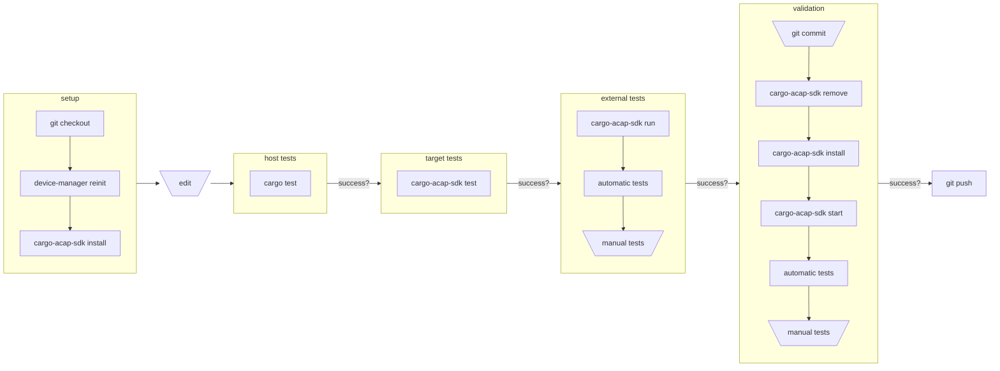
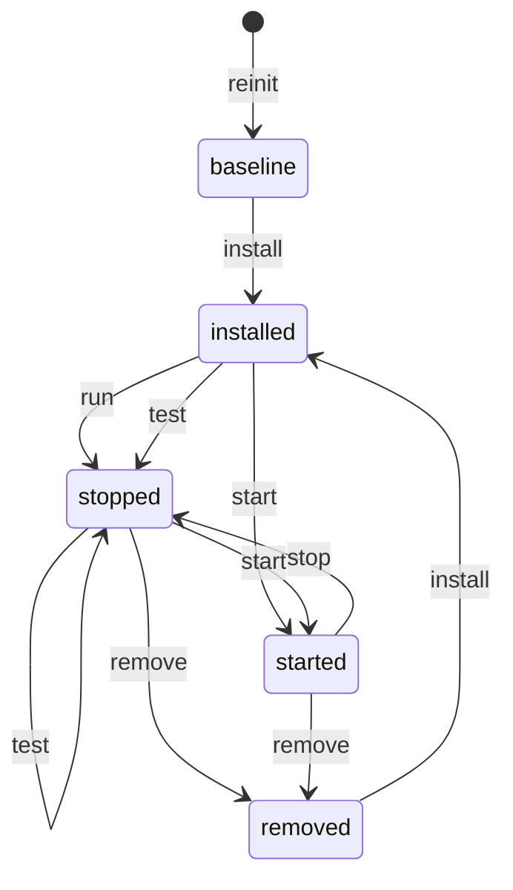

# App development model

One of the guiding principles for this project is that _common things should be easy and rare things should be possible_.
To help make common things easy and to communicate how the tools are designed to work it is helpful crate some models.

## Typical workflow

If any step fails, the solution is typically going back to edit the code. 

Note that this is only a model and as such it is necessarily wrong, but hopefully this one is
useful.

## Device state

Another way to understand the development process and tools is by looking at how the state of the
device is affected by various commands:

Notable aspects omitted from the above model include:

- Build profile: `install` builds the app with a different profile than `run` and `test`.
- Rare side effects: installing and running an app can have side effects that are not undone by removing the app.
  This is especially true on older firmwares where the post-install script and the app itself were allowed to run as root.